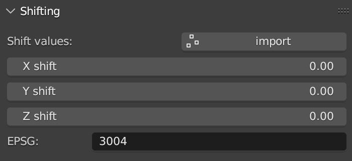
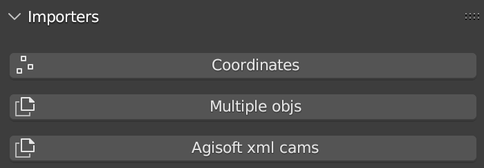
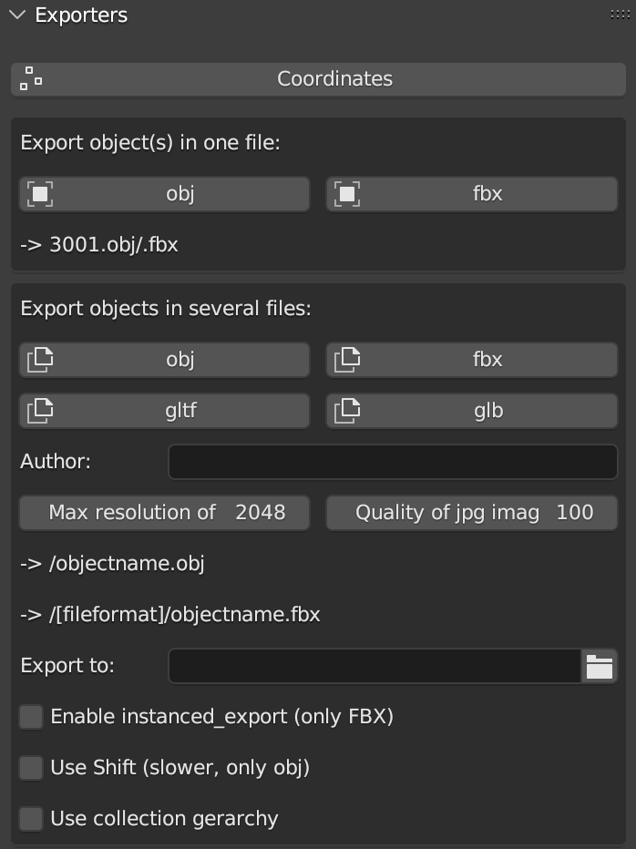
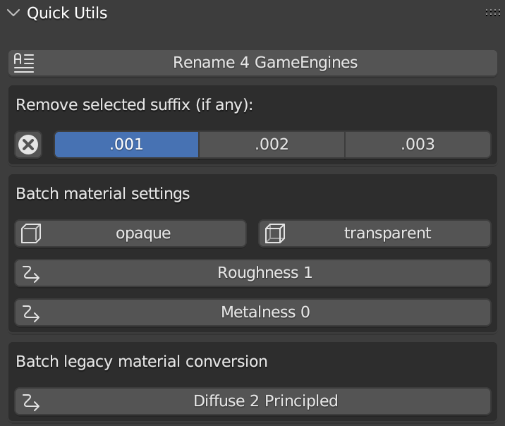
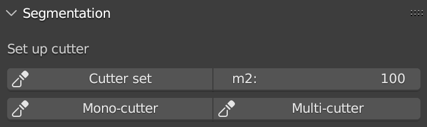
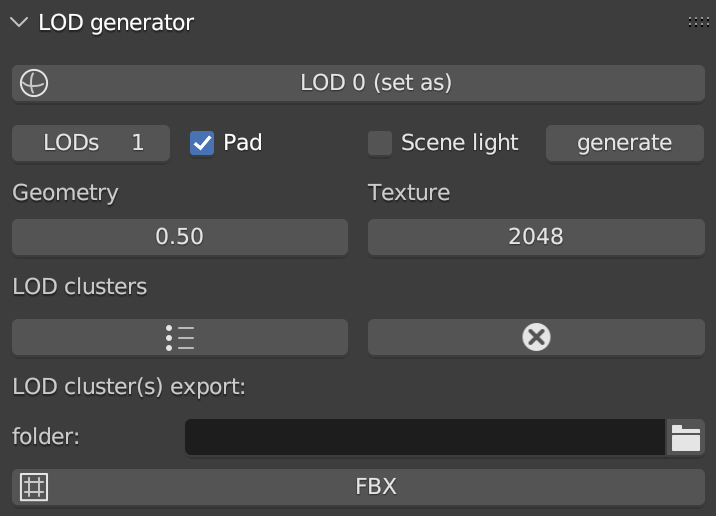
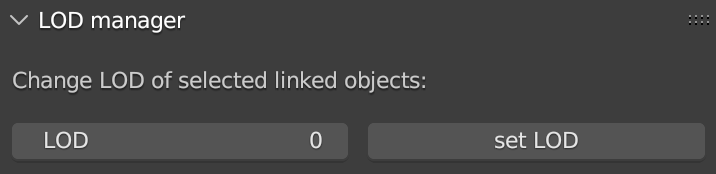
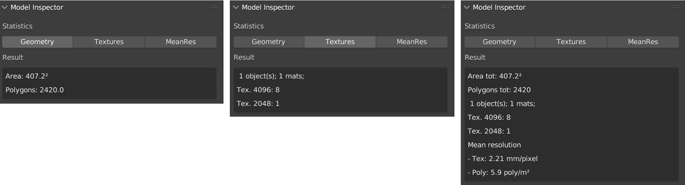
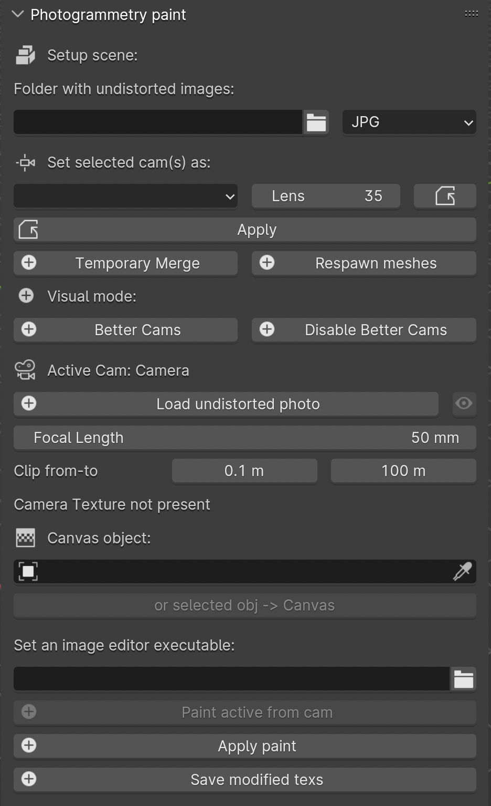

3D Survey Collection (3DSC) Structure
=====================================

**3DSC** is divided into several independent panels (at least 9 panels are available on the LTS version) which are automatically displayed on the sidebar of Blender after pressing the *3DSC* tab. 

Panels appears as follows: 

- Shifting; 

- Importers;

- Exporters; 

- Quick Utils; 

- LOD generator; 

- LOD manager; 

- Color Correction; 

- Photogrammetry paint; 

- Texture mixer;

- Model Inspector. 

.. _Shifting:

Shifting
--------

.. _ShiftingFIG:

   Shifting panel

This panel (:numref:`Fig. %s <ShiftingFIG>`), which is directly linked with the *Importers* panel, represents the shifting values for X, Y, Z. 
Shifting values indicate the translation of the objects with respect to the absolute coordinates.
To automatically visualize the shift values it is necessary to create a shift file (SHIFT.txt).

This is an example of first line of the shift file:
EPSG::3004 2392800.00 5069900.00 0

The *import* button allows to load the shift file.

.. _Importers:

Importers
---------

.. _ImportersFIG:

   Importers panel

This panel (:numref:`Fig. %s <ImportersFIG>`) allows to import in Blender three different types of data: coordinates, objects and cameras.

.. 
   of the add-on is useful for users that work with photogrammetric meshes that could be exported with absolute coordinates from the photogrammetric software.

.. 
   If user has already activated “Blender Gis” add-on, this feature will be useful to interact with other files associated with absolute coordinates.

  

In the first case, by clicking the *Coordinates* button user can import in Blender 2D point (such as .csv files) of both relative and absolute coordinates. 
On the menu which appears on the right side of the window, user can associate the first 4 columns of the coordinates with the correspondent values (name, X, Y, Z) and then define the separator (comma, space, semicolon). 
To visualize absolute coordinates within Blender, user must flag *Shift coordinates* button and 3DSC will automatically shift the file.

In the second case, 3DSC allows to import several objects with a single command. 
By clicking on the *Multiple objs* button an import window will appear. Here, users must select the desired meshes and then select the correct options on the right side.
The latter are the same options that usually appear in the default *import .obj* menu of Blender.

In the third case, by clicking the *Agisoft xml cams* user can import cameras from a project of Metashape (Agisoft xml file).

.. _Exporters:

Exporters
---------

.. _ExportersFIG:

   Exporters panel

This panel (:numref:`Fig. %s <ExportersFIG>`) is divided in three sub-sections: *Coordinates*, *Export object(s) in one file* and *Export objects in several files*.

The *Coordinates* button allows to export in .txt file format every type of coordinates associated to an object (such as: points, meshes, cameras etc..) within the 3D space of Blender. 
On the right side of the export window, user can choose to flag some precise features (*Add names of objects*; *Add coordinates of rotation*; *Export only cams*; *World shift coordinates*) to customize the exportation. 

This specific tool of 3DSC allows also to export instanced objects. 
To export this type of objects user has to: 

- place in x=0, y=0, z=0 the instanced object (**NB**: in this case, before starting the process, it is necessary to apply transformations to the object - such as: location, scale, and rotation -); 
 
- select all the objects to be exported and then select the object in 0,0,0; 

- click the *Coordinates* button in the *Exporters* panel of 3DSC.

The other two *Exporters* execute the same (export) action but with two different results. 
The *Export object(s) in one file* section allows to export single or multiple objects in one file. 
Two different file formats are available for the export, user can choose these formats by clicking on *obj* or *fbx* button. 

Before starting the export process, user has to define the path of the folder where the exporter must save files (**NB**: before closing the path windows remember to uncheck *relative path* within the settings. 
Alternatively, it is possible to paste the entire path within the empty line). 

The second option *Export objects in several files* allows to export a selection of objects in single files.
The available file formats are *obj*, *fbx*, *gltf* and *glb*, they can be chosen by clicking on the correspondent buttons.

In the lower part of the panel user can also select three different types of options: *enable instanced_export (only FBX)*, *Use Shift (slower, only obj)*, *use collection gerarchy*.

The option *enable instanced_export (only FBX)* allows to export FBX file with instaced objects: select a group of objects and the add-on will generate a single file *[name]-inst.txt* using the name of the active object.

The option *Use Shift (slower, only obj)* permits to export obj file with shift values. This process may be slower with big obj file. 

The option *use collection gerarchy* consents to apply collection gerarchy for creating a tree of subfolders useful for Game Engines.

.. _Quick_Utils:

Quick Utils
-----------

.. _Quick_UtilsFIG:

   Quick Utils panel

This panel (:numref:`Fig. %s <Quick_UtilsFIG>`) permits to customize some features of the 3D objects with a series of batch processes that can assist users organize objects within the Blender file.  

The *Rename 4 GameEngines* button allows to automatically modify the name of a list of selected objects by adding the prefix *OB_actual name of the object*, which stands for *OB(JECT)_*.

The *Remove selected suffix (if any)* tool allows user to organize the list of objects in the scene by simply removing the selected suffix (.001, .002, .003). 
First, to use this tool it is necessary to select the objects to be cleaned and then add the prefix *OB_* by clicking on the *Rename 4 GameEngine* button. 
Second, select the suffix to be clean and then press on the *X* button.

The *Batch material settings* tool consents to automatically change four characteristics of the material of a mesh. 
First, select single or multiple objects. 
Second, select the option to change (*opaque*, *transparent*, *roughness*, *Metalness*) in the material. 

By clicking on the *opaque* button 3DSC will change the Blend mode of the material (located in: *Material Properties*, *Viewport Display*, *Settings*, *Blend Mode*) into *Opaque*.

By clicking on the *transparent* button 3DSC will change the Blend mode of the material (located in: *Material Properties*, *Viewport Display*, *Settings*, *Blend Mode*) into *Alpha mode*. 

By clicking on the *Roughness 1* button 3DSC will change the Roughness value to 1 within the Principled BSDF node.

By clicking on the *Metalness 0* button 3DSC will change the Roughness value to 0 within the Principled BSDF node.

The *Batch legacy material conversion* tool allows to convert a simple diffuse material into a Principles BSDF. 
First, select single or multiple objects. 
Second, press on the *Diffuse 2 Principled* button. 

.. _Segmentation:

Segmentation
------------

.. _SegmentationFIG:

   Segmentation panel

.. 
   This panel (:numref:`Fig. %s <SegmentationFIG>`)

.. _LODgenerator:

LOD generator
-------------

.. _LODgeneratorFIG:

   LOD generator panel

This panel (:numref:`Fig. %s <LODgeneratorFIG>`) consents to generate Levels of Details (LODs) of a selected mesh. 
This type of tool is useful to manage large and detailed datasets, such as a mesh from photogrammetry or a mesh obtained with a laser scanner.

To use this tool user needs to first indicate the *LOD0*, the mesh with the highest level of detail within the Blender file. 
First, select the object. 
Second, press the *LOD 0 (set as)* button to indicate this object as the LOD 0.

Before generating multiple LODs user must follow some necessary steps: first, set the number of LOD by adding the correct number under the *LOD 0 (set as)* button; 
second, flag the *Pad* and/or the *Scene light* option to activate the paddin ratio for the LOD and/or the scene light baking;
third, set the *decimation ratio*; 
fourth, set the *resolution of the baked texture*; 
fifth, within the section *LOD cluster(s) export*, indicate the *path of the folder* where LOD will be saved (**NB**: before closing the path windows remember to uncheck *relative path* within the settings. 
Alternatively, it is possible to paste the entire path within the empty line). 
After setting these options, by pressing the *generate* button LODs will be created in the desired folder. 

If necessary, the *LOD generator tool* permits to create a group of LODs, by clicking on the *LOD clusters* button, and remove it, by pressing the *X* button. 

The *FBX* button allows to export LODs’ cluster in FBX format in the folder previously indicated. 

.. _LODmanager:

LOD Manager
-----------

.. _LODmanagerFIG:

   LOD Manager panel

This panel (:numref:`Fig. %s <LODmanagerFIG>`) permits to change the LOD for each tile of a 3D object which is displayed in the viewport of Blender. 
This type of tool allows to manage the visualization of large datasets which have already been segmented (using the *Segmentation* tool). 
Using this tool users can view different tiles of the same 3D mesh with different LODs
(**NB**: this tool can be employed only if LODs have been previously generated).

To visualize a specific LOD: 
first, select an object that has been previously processed with the *LOD generator tool*; 
second, enter the desired LOD to be visualized; 
third, press the *set LOD* button.

.. _Model_Inspector:

Model Inspector
---------------

.. _Model_Inspector00FIG:

   Model Inspector panel (*Geometry* statistics on the left, *Textures* statistics in the center, *MeanRes* statistics on the right)

This panel consists of three main parts (:numref:`Fig. %s <Model_Inspector00FIG>`): *Geometry*, *Texture* and *MeanRes*.

By clicking on the *Geometry* button the add-on returns some statistics on the geometry of the selected 3D object (*area* and *number of polygons*).

By clicking on the *Textures* button the add-on returns some statistics on the texture of the selected 3D object (*number of materials*, *resolution of the texutre*, *number of texture per resolution*).

By clicking on the *MeanRes* button the add-on returns a summary of all the statistical values (*Geometry*, *Texture* and *MeanRes*) concerning the selected 3D object (*area* and *number of polygons*, *number of materials*, *resolution of the texutre*, *number of texture per resolution*, *mean resolution per texture* - mm/pixel and *mean resolution per polygons* - :math:`poly/m^2`).

|

.. _ColorCorrection:

Color Correction
----------------

.. _ColorCorrectionFIG:

|

.. _Photogrammetry_paint:

Photogrammetry paint
--------------------

.. _Photogrammetry_paintFIG:

   Photogrammetry Paint panel

The panel is part of a photogrammetric enhancement pipeline, enabling the setting up of a folder with undistorted images from a photogrammetric process, such as those processed by Metashape. This is where cameras can be converted and all images can be managed in an undistorted fashion. Prior to using this add-on, it is necessary to import cameras from photogrammetry software, such as Metashape via the DAE Collada format, which will allow importing the cameras along with the photogrammetric model's mesh. This mesh can either be discarded if not needed or used to improve its texturing.

Essentially, this panel aims to enhance the photogrammetric texturing process by correcting any imperfections that, despite accurate photogrammetry, might result in smudges. For instance, issues such as poor image reprojection from the cameras in photogrammetry software can be addressed. With this add-on, users can load all undistorted images into Blender, enter individual cameras, and reproject parts of the original image onto the surface, thereby dramatically improving the overall visual quality of the 3D model.

To use this feature, the undistorted path must be set, then the relevant camera selected from the dropdown menu, which includes a range of available cameras that can be further expanded by modifying the `cams.xml` in the add-on's `src` subfolder or by contacting [email](emanuel.demetrescudio.cnr.it) to integrate additional sensors. The camera's millimeters must also be set before pressing 'Apply' to modify the cameras.

Furthermore, there is a "Remove Better Cams" section that adjusts the camera layout to make them smaller and cleaner in the 3D space, allowing for the neat organization of hundreds of cameras. This function also activates camera directions to understand which camera affects which part of the model, and there is a button for tuning where the camera's clipping plane can be indicated with minimum and maximum values. This can be set at any time.

Once the cameras are set up in the system, users can activate any of the cameras to reproject a better image onto the surface of the mesh. This function allows for the selective improvement of the mesh's texture by utilizing superior images from specific camera angles, leading to a refined and visually enhanced 3D model.

The "Load Undistorted Photo" function loads the undistorted image behind the camera, allowing for the texture to be reprojected onto the mesh. Users can fine-tune the focal length if the initial setting (e.g., 35 mm) is slightly off, adjusting to, for instance, 34.7 mm or 34.8 mm. The clipping in the camera can also be modified to extend beyond the default setting if needed to reach further, like over 4 meters. Before starting the painting process, it's important to select the object to be reprojected on in the "Canvas Object" field, using the dropper tool or by selecting the object in the 3D space and then pressing "or select obj to canvas."

Before painting, an image editor like GIMP should be set by providing the path to its executable. After setting up, the "Paint Active from Cam" button allows for painting from the loaded camera perspective. It opens two instances of GIMP: one displaying the camera's view and the other the undistorted image. The user can copy the entire undistorted image with CTRL A and CTRL C and paste it into the canvas representing the 3D model. With the clone brush, unnecessary parts of the photograph are removed, and color correction is performed to blend seamlessly with the background image of the 3D model.

Once satisfied with the result, the background layer is disabled, and the PNG file is overwritten to create a patch. Back in Blender, the patch is applied to the 3D model with the "Apply Paint" button, which updates the model's texture with the new, improved patch. Finally, "Save Modified Textures" is pressed to complete the process.

A subsidiary panel of the camera will remain with the undistorted image; this can be made transparent with the button next to "Load Undistorted Photo" or deleted manually by going into the individual camera settings.

The "Temporary Merge" function allows users to temporarily join two mesh objects in the scene. This feature is particularly useful for tasks that require meshes to be combined, such as texture painting to correct imperfections. For instance, users can utilize a clone stamp to transfer texture from one part of a mesh to another, effectively treating the meshes as a single unit. This can also be useful for creating a single UV unwrap atlas for multiple objects. After the necessary operations are completed, the "Respawn" button can be used to separate the meshes and return them to their original state.

|

.. _Texture_mixer:

Texture mixer
-------------

.. _Texture_mixerFIG:

|

