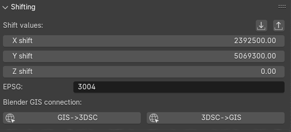
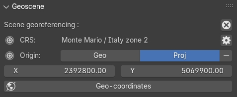
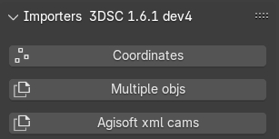
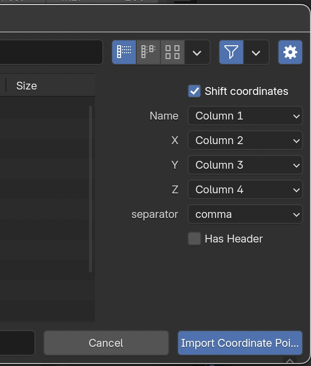
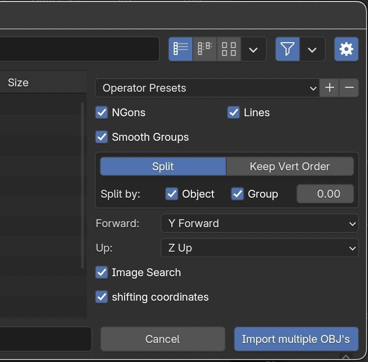
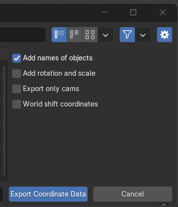
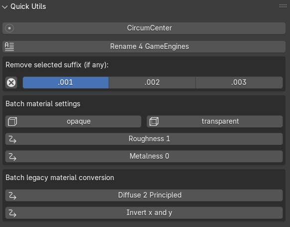

3D Survey Collection (v. 1.6.0) Structure
=====================================

3DSC is composed of several independent panels placed on the sidebar of Blender, within the tab named *3DSC*. 
Panels can easily be arranged by grabbing them from the top right corner. 

.. contents::
   :local:
   :depth: 1

.. admonition:: Remember

   The add-on, within the preference menu of Blender, offers a feature that checks for new updates and then asks user for the installation.

.. _Shifting:

Shifting
--------

.. _ShiftingFIG:

   Shifting panel

This panel (:numref:`Fig. %s <ShiftingFIG>`), which is directly linked to the *Importers* panel, represents the shifting values (expressed with X, Y, Z) of an object (for example a 2D/3D survey) imported in Blender. Shifting values indicate the translation of an imported 2D survey or 3D object respect to absolute coordinates. On the lower part of the panel, the line *EPSG* indicates the Reference System (RS) whom 2D and 3D objects, imported in the Blender file, will refer to. 

.. admonition:: Remember

   In order to visualize georeferenced 3D models in Blender, as the ones obtained with photogrammetry, it is strongly suggested to export them with the same shift used in 3DSC and BlenderGis.

To insert shift values in Blender two modes are available: manual and automatic.  

**Manual** mode implies that user insert manually both the coordinates and the EPSG code.

On the contrary, **Automatic** mode (RECOMMENDED) implies that a *SHIFT.txt* file is automatically read by 3DSC (**ONLY** if the file is placed in the folder where the *.blend* file is saved) and, instantly, *shift coordinates* will appear within the *Shift values* lines. 
To use this automatic mode, press the *import shift coordinated from file*, on the right corner of the panel, and locate the *SHIFT.txt* file.  

.. admonition:: Remember

   The *SHIFT* file is a simple *.txt* file which contains only one line of data (EPSG:: code X Y Z) here an example:
   
   EPSG::3004 2392800.00 5069900.00 0 

By pressing the *Export Shift values* button, the shift panel allows to export shift coordinates (*.txt* format) for different purposes. 

In order to easily use georeferenced data within Blender it is necessary to set the same SHIFT coordinates also in BlenderGIS (RECOMMENDED). 
As already mentioned for 3DSC, this important step for BlenderGis can be accomplished in two ways: manual and automatic.

.. _Shifting_02FIG:

   *Geoscene* panel, within the *View* tab, on the sidebar of Blender

**Manual** mode implies that user manually inserts data (coordinates and EPSG) within the *Preferences* of BlenderGIS. 
Then, to confirm this information, user must set the RS and the shift coordinates in the *View* tab, located on the Sidebar of Blender, within the panel *Geoscene* (:numref:`Fig. %s <Shifting_02FIG>`). 
In the *Preferences* of BlenderGis, before setting the shift coordinates, user must set the correct RS by pressing the *add* button.  

**Automatic** mode involves the use of an automatic procedure that imports shift data from 3DSC to BlenderGIS. 
In the *Shifting* panel of 3DSC, it is possible to activate this option by pressing the *3DSC->GIS* button. 
At the end of this process, it is recommended to control in the *Geoscene* panel, located in the View tab of the sidebar of Blender, if data are correctly inserted. 

If SHIFT coordinates have been previously set up in BlenderGIS, by pressing the *GIS->3DSC* button all the SHIFT data will be setting up in 3DSC. 

.. admonition:: Remember

   Before saving the file, it’s recommended to check if SHIFT data are synchronized between 3DSC and BlenderGIS.

After shift data has been correctly inserted and an empty Blender file has been setting up and saved, user can easily import georeferenced data by using both 3DSC or BlenderGIS import options. 

.. _Importers:

Importers
---------

.. _ImportersFIG:

   Importers panel

.. admonition:: Remember

   To import georeferenced data in Blender it is important to set the *SHIFT* data, see the :ref:`Shifting` section.

This panel (:numref:`Fig. %s <ImportersFIG>`) allows to import in Blender three different types of data: coordinates, objects and cameras.

By clicking the *Coordinates* button user can import a 2D survey (*.csv* or *.txt*) in relative or absolute coordinates. 

.. _ImportersFIG_02:

   Option of the Importers panel

In the import window, user must: first, locate the appropriate file; second, after pressing the *Toggle Region* button (the one with a gear on the icon, placed on the right side of the window) associate the first 4 columns of the coordinates file with the equivalent values (name, X, Y, Z) of the selected file (*.csv* or *.txt*) and define the separator (comma, space, semicolon, :numref:`Fig. %s <ImportersFIG_02>`). 

In the first case, by clicking the *Coordinates* button user can import in Blender 2D point (such as .csv files) of both relative and absolute coordinates. 
On the menu which appears on the right side of the window, user can associate the first 4 columns of the coordinates with the correspondent values (name, X, Y, Z) and then define the separator (comma, space, semicolon). 
To visualize absolute coordinates within Blender, user must flag *Shift coordinates* button and 3DSC will automatically shift the file.
The options *Shift coordinates* and *Has header*, respectively on the top and on the lower part of the right side of the *Toggle Region* window, allow to: force 3DSC to consider the SHIFT coordinates (if the 2D survey is georeferenced and if the SHIFT has previously set up on 3DSC and BlenderGis) and ignore the first line of the selected file (if a header is presented). 

.. _ImportersFIG_03:

   Option of the Importers panel related to objects

By clicking on the *Multiple objs* button 3DSC allows to import several objects with a single command. 
In the import window, user must: first, locate the appropriate file; second, select the correct options on the right side of the window (default option allow to successfully import the obj file). If the obj file are not *Z Up* and *Y Forward* oriented, user can choose the correct orientation by exploring the corresponding drop-down menu (:numref:`Fig. %s <ImportersFIG_03>`). 
The option *shifting coordinates*, if selected, allow to import georeferenced data with an associated *SHIFT.txt* file. 

.. _Exporters:

Exporters
---------

.. _ExportersFIG:

.. figure:: img/Exporters.png
   :width: 400
   :align: center

   Exporters panel

This panel (:numref:`Fig. %s <ExportersFIG>`) is divided in three sub-sections: *Coordinates*, *Export object(s) in one file* and *Export objects in several files*.

The *Coordinates* button allows to export every type of coordinates (*.txt* file) associated to an object (such as: points, meshes, cameras etc..) imported in the 3D space of Blender. 
After pressing the button, the export window will appear. 

.. _ExportersFIG_02:

   Exporter window options

To customize the export of these data the user can flag specific options (Add names of objects; Add coordinates of rotation; Export only cams; World shift coordinates) placed on the right side of the export window (:numref:`Fig. %s <ExportersFIG_02>`).  

The other two Exporters execute the same (export) action, with two different results. 
The *Export object(s) in one file* section allows to export, one or multiple objects, in a single file. 
By clicking the *obj* or *fbx* button, the user can choose between two different export file formats (*.obj* or *.fbx*). 
The name of the exported object appears directly below the *obj* and *fbx* buttons. 
By default, the name corresponds to the selected object.

Before starting the export process, the user has to define the correct path of the folder where file(s) will be saved. 

.. admonition:: Remember

   Before closing the path window, it is recommended to uncheck the *relative path* option in the export window settings. Alternatively, within the export panel of 3DSC, it is possible to directly paste the entire path into the empty field and then confirm by pressing the *Enter* button.   

The second option (*Export objects in several files*) allows to export selected objects in several files (*obj*, *fbx*, *gltf*, and *glb*). 
Before exporting the objects, the user can also define properties such as: author, texture resolution, and texture quality. 
Also in this case, a preview of the name associated with the exported objects appears directly below the *Max resolution* and *Quality* buttons. 
By default, the name of each exported objects corresponds to *objectname.fileFormat*.

By activating the *Use shift* options, 3DSC will export only *obj* files with the corresponding shift. 
This option will permit to import these geometries within software that can manage georeferenced data. 
For example, this option will be useful with tiles that need to be textured within a photogrammetric software, as explained in the next sections. 

The Exporter tool of 3DSC allows also to export instanced objects. 
To export this type of objects it is necessary to:

- place in x=0, y=0, z=0 the instanced object with location, scale, and rotation applied (*ctrl+a* command within the viewport of Blender); 
- select all the objects to be exported and then select the object in 0,0,0; 
- click the *Coordinates* button in the *Exporters* panel of 3DSC;
- locate the folder where the *.txt* file has to be saved and set the name of the file
- flag the right options (:numref:`Fig. %s <ExportersFIG_02>`)
- press the *Export Coordinate Data* button.
 
This procedure will create a *.txt* file with the locations of to the instanced object. 
This procedure will work also for *obj*, *fbx*, *gltf* and *glb*. 

At the bottom of the Exporter panel, the option *Enable instanced_export (only FBX)*, if selected, activates an automatic procedure available only for *.fbx* files.
This procedure requires, first, the selection of a group of objects and, then, the add-on will generate a single file *[name]-inst.txt* using the name of the active object.

In the same part of the panel the user can also select two others options: *Use Shift (slower, only obj)* and *use collection gerarchy*.

The option *Use Shift (slower, only obj)* permits to export *obj* file(s) with shift values. 
This process may be slower with big *obj* file(s). 

The option *use collection gerarchy* consents to apply collection gerarchy for creating a tree of subfolders useful for Game Engines.

.. _Quick_Utils:

Quick Utils
-----------

.. _Quick_UtilsFIG:

   Quick Utils panel

This panel (:numref:`Fig. %s <Quick_UtilsFIG>`) permits to customize some features of the 3D objects with a series of batch processes that can assist users organize objects within the Blender file.  

The *CircumCenter* button allows user to create a circle starting from 3 points. 
This function works only in edit mode and only if points are associated to the *XY plane* (only if they have the same Z value). 

The *Rename 4 GameEngines* button allows to automatically modify the name of a list of selected objects by adding the prefix *OB_actual name of the object*, which stands for *OB(JECT)_*.

The *Remove selected suffix (if any)* tool allows user to organize the list of objects in the scene by simply removing the selected suffix (.001, .002, .003). 
First, to use this tool it is necessary to select the objects to be cleaned and then add the prefix *OB_* by clicking on the *Rename 4 GameEngine* button. 
Second, select the suffix to be clean and then press on the *X* button.

The *Batch material settings* tool consents to automatically change four characteristics of the material of a mesh. 
First, select single or multiple objects. 
Second, select the option to change (*opaque*, *transparent*, *roughness*, *Metalness*) in the material. 

By clicking on the *opaque* button 3DSC will change the Blend mode of the material (located in: *Material Properties*, *Viewport Display*, *Settings*, *Blend Mode*) into *Opaque*.

By clicking on the *transparent* button 3DSC will change the Blend mode of the material (located in: *Material Properties*, *Viewport Display*, *Settings*, *Blend Mode*) into *Alpha mode*. 

By clicking on the *Roughness 1* button 3DSC will change the Roughness value to 1 within the Principled BSDF node.

By clicking on the *Metalness 0* button 3DSC will change the Roughness value to 0 within the Principled BSDF node.

The *Batch legacy material conversion* tool allows to convert a simple diffuse material into a Principles BSDF. 
First, select single or multiple objects. 
Second, press on the *Diffuse 2 Principled* button. 

The *Invert x and y* button inverts the coordinates of the object’s origin. 
This function works only in object mode, and it does not affect the Z value. 

.. _Segmentation:

Segmentation
------------

.. _SegmentationFIG:

.. figure:: img/Segmentation.png
   :width: 400
   :align: center 

   Segmentation panel

.. 
   This panel (:numref:`Fig. %s <SegmentationFIG>`)

.. _LODgenerator:

LOD generator
-------------

.. _LODgeneratorFIG:

.. figure:: img/LODgenerator.png
   :width: 400
   :align: center 

   LOD generator panel

This panel (:numref:`Fig. %s <LODgeneratorFIG>`) consents to generate Levels of Details (LODs) of a selected mesh. 
This type of tool is useful to manage large and detailed datasets, such as a mesh from photogrammetry or a mesh obtained with a laser scanner.

To use this tool user needs to first indicate the *LOD0*, the mesh with the highest level of detail within the Blender file. 
First, select the object. 
Second, press the *LOD 0 (set as)* button to indicate this object as the LOD 0.

Before generating multiple LODs user must follow some necessary steps: first, set the number of LOD by adding the correct number under the *LOD 0 (set as)* button; 
second, flag the *Pad* and/or the *Scene light* option to activate the paddin ratio for the LOD and/or the scene light baking;
third, set the *decimation ratio*; 
fourth, set the *resolution of the baked texture*; 
fifth, within the section *LOD cluster(s) export*, indicate the *path of the folder* where LOD will be saved (**NB**: before closing the path windows remember to uncheck *relative path* within the settings. 
Alternatively, it is possible to paste the entire path within the empty line). 
After setting these options, by pressing the *generate* button LODs will be created in the desired folder. 

If necessary, the *LOD generator tool* permits to create a group of LODs, by clicking on the *LOD clusters* button, and remove it, by pressing the *X* button. 

The *FBX* button allows to export LODs’ cluster in FBX format in the folder previously indicated. 

.. _LODmanager:

LOD Manager
-----------

.. _LODmanagerFIG:

.. figure:: img/LODmanager.png
   :width: 400
   :align: center 

   LOD Manager panel

This panel (:numref:`Fig. %s <LODmanagerFIG>`) permits to change the LOD for each tile of a 3D object which is displayed in the viewport of Blender. 
This type of tool allows to manage the visualization of large datasets which have already been segmented (using the *Segmentation* tool). 
Using this tool users can view different tiles of the same 3D mesh with different LODs
(**NB**: this tool can be employed only if LODs have been previously generated).

To visualize a specific LOD: 
first, select an object that has been previously processed with the *LOD generator tool*; 
second, enter the desired LOD to be visualized; 
third, press the *set LOD* button.

.. _Model_Inspector:

Model Inspector
---------------

.. _Model_Inspector00FIG:

.. figure:: img/Model_Inspector00.png
   :width: 800
   :align: center 

   Model Inspector panel (*Geometry* statistics on the left, *Textures* statistics in the center, *MeanRes* statistics on the right)

This panel consists of three main parts (:numref:`Fig. %s <Model_Inspector00FIG>`): *Geometry*, *Texture* and *MeanRes*.

By clicking on the *Geometry* button the add-on returns some statistics on the geometry of the selected 3D object (*area* and *number of polygons*).

By clicking on the *Textures* button the add-on returns some statistics on the texture of the selected 3D object (*number of materials*, *resolution of the texutre*, *number of texture per resolution*).

By clicking on the *MeanRes* button the add-on returns a summary of all the statistical values (*Geometry*, *Texture* and *MeanRes*) concerning the selected 3D object (*area* and *number of polygons*, *number of materials*, *resolution of the texutre*, *number of texture per resolution*, *mean resolution per texture* - mm/pixel and *mean resolution per polygons* - :math:`poly/m^2`).

|

.. _ColorCorrection:

Color Correction
----------------

.. _ColorCorrectionFIG:

|

.. _Photogrammetry_paint:

Photogrammetry paint
--------------------

.. _Photogrammetry_paintFIG:

.. figure:: img/PhotogrammetryPaint.png
   :width: 400
   :align: center 

   Photogrammetry Paint panel

# Photogrammetry Paint Panel

The "Photogrammetry Paint" panel in Blender is tailored for enhancing photogrammetric workflows. It provides a suite of tools for image and texture editing, enabling the user to work efficiently within the 3D environment. This panel facilitates various tasks such as managing undistorted images, merging and separating meshes for texture painting, adjusting camera settings for image projection, and integrating with external image editors for in-depth texture work.

## Features

- **Setup Scene**: Initializes the scene for photogrammetric texture editing.

- **Folder with Undistorted Images**: Assign a directory containing the undistorted images to be used in texture painting.

- **Set Selected Cam(s) As**: 
  - **Lens**: Select the type of lens used to capture your images.
  - **Focal Length**: Input the focal length of the camera lens.
  - **Apply**: Save your configured camera settings.

- **Temporary Merge/Respawn Meshes**: 
  - **Temporary Merge**: Combine selected meshes for collective texturing.
  - **Respawn Meshes**: Separate previously merged meshes back to their original state.

The "Temporary Merge" function allows users to temporarily join two mesh objects in the scene. This feature is particularly useful for tasks that require meshes to be combined, such as texture painting to correct imperfections. For instance, users can utilize a clone stamp to transfer texture from one part of a mesh to another, effectively treating the meshes as a single unit. This can also be useful for creating a single UV unwrap atlas for multiple objects. After the necessary operations are completed, the "Respawn" button can be used to separate the meshes and return them to their original state.

- **Visual Mode**: 
  - **Better Cams**: Enhance camera visualization for easier editing.
  - **Disable Better Cams**: Revert to the standard camera view.

- **Active Cam**: Display the camera that is currently being used for editing.

- **Load Undistorted Photo**: Load the undistorted image for the active camera, ready for texture painting.

- **Focal Length/Clip from-to**: Fine-tune the active camera's focal length and clipping range for precise texture projection.

- **Camera Texture Not Present**: Notification when a camera texture is missing.

- **Canvas Object**: Select the object which will receive the projected textures.

- **Set an Image Editor Executable**: Specify the path to an external image editor for advanced texture editing.

## Post-Processing in External Image Editors

After pressing the **Paint Active from Cam** button, the user engages in a post-processing phase, typically in an external image editor such as GIMP or Photoshop. Here is what generally occurs during this phase:

### GIMP/Photoshop Workflow:

1. **Open Image Editor**: GIMP or Photoshop launches with two instances; one displaying the active camera's view and the other showing the undistorted image.

2. **Copy/Paste Textures**: 
   - Use `CTRL+A` and `CTRL+C` to select and copy the entire undistorted image.
   - Paste it onto the canvas that represents the 3D model.

3. **Clone Brush Tool**: Utilize the clone brush to remove unnecessary parts of the photograph and make chromatic adjustments. This ensures that the newly applied texture blends seamlessly with the existing textures.

4. **Finalizing Texture**: Once the texture editing is complete:
   - Disable the background layer in the image editor to isolate the new texture.
   - Save the new texture by overwriting the existing file or as a new file to be used as a patch.

5. **Apply New Texture in Blender**: Back in Blender, the **Apply Paint** function transfers the edited texture onto the 3D model.

6. **Save and Update Model**: Hit **Save Modified Textures** to save your changes, solidifying the improved texture on the model.

Remember to periodically save your work in the external editor and keep track of version changes to ensure a smooth workflow.

Leverage the Photogrammetry Paint panel to ensure your textures align perfectly with the undistorted images, creating high-quality, realistic 3D models.

|

.. _Texture_mixer:

Texture mixer
-------------

.. _Texture_mixerFIG:

|

