3D Survey Collection (v. 1.7.0) Structure
=====================================

3DSC is an end-to-end toolkit for georeferenced 3D survey workflows in Blender.
From import and QA to LOD, optimization, and export, it supports a complete operational pipeline with contextual help per tool.
Panels are organized in the *3DSC* tab of the Blender sidebar and can be rearranged from their top-right handle.

.. contents::
   :local:
   :depth: 1

.. admonition:: Remember

   The add-on, within the preference menu of Blender, offers a feature that checks for new updates and then asks user for the installation.

.. _Shifting:

Shifting
--------

.. _ShiftingFIG:

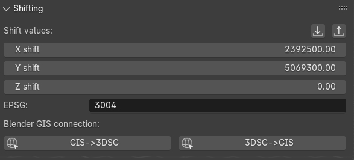

   Shifting panel

This panel (:numref:`Fig. %s <ShiftingFIG>`), which is directly linked to the *Importers* panel, represents the shifting values (expressed with X, Y, Z) of an object (for example a 2D/3D survey) imported in Blender. Shifting values indicate the translation of an imported 2D survey or 3D object respect to absolute coordinates. On the lower part of the panel, the line *EPSG* indicates the Reference System (RS) whom 2D and 3D objects, imported in the Blender file, will refer to. 

.. admonition:: Remember

   In order to visualize georeferenced 3D models in Blender, as the ones obtained with photogrammetry, it is strongly suggested to export them with the same shift used in 3DSC and BlenderGis.

To insert shift values in Blender two modes are available: manual and automatic.  

**Manual** mode implies that user insert manually both the coordinates and the EPSG code.

On the contrary, **Automatic** mode (RECOMMENDED) implies that a *SHIFT.txt* file is automatically read by 3DSC (**ONLY** if the file is placed in the folder where the *.blend* file is saved) and, instantly, *shift coordinates* will appear within the *Shift values* lines. 
To use this automatic mode, press the *import shift coordinated from file*, on the right corner of the panel, and locate the *SHIFT.txt* file.  

.. admonition:: Remember

   The *SHIFT* file is a simple *.txt* file which contains only one line of data (EPSG:: code X Y Z) here an example:
   
   EPSG::3004 2392800.00 5069900.00 0 

By pressing the *Export Shift values* button, the shift panel allows to export shift coordinates (*.txt* format) for different purposes. 

In order to easily use georeferenced data within Blender it is necessary to set the same SHIFT coordinates also in BlenderGIS (RECOMMENDED). 
As already mentioned for 3DSC, this important step for BlenderGis can be accomplished in two ways: manual and automatic.

.. _Shifting_02FIG:

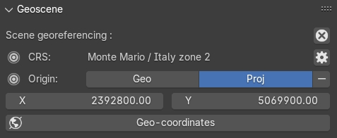

   The *Geoscene* panel of BlenderGIS

**Manual** mode implies that user manually inserts data (coordinates and EPSG) within the *Preferences* of BlenderGIS. 
Then, to confirm this information, user must set the RS and the shift coordinates in the *View* tab, located on the Sidebar of Blender, within the panel *Geoscene* (:numref:`Fig. %s <Shifting_02FIG>`). 
In the *Preferences* of BlenderGis, before setting the shift coordinates, user must set the correct RS by pressing the *add* button.  

**Automatic** mode involves the use of an automatic procedure that imports shift data from 3DSC to BlenderGIS. 
In the *Shifting* panel of 3DSC, it is possible to activate this option by pressing the *3DSC->GIS* button. 
At the end of this process, it is recommended to control in the *Geoscene* panel, located in the View tab of the sidebar of Blender, if data are correctly inserted. 

If SHIFT coordinates have been previously set up in BlenderGIS, by pressing the *GIS->3DSC* button all the SHIFT data will be setting up in 3DSC. 

.. admonition:: Remember

   Before saving the file, it’s recommended to check if SHIFT data are synchronized between 3DSC and BlenderGIS.

After shift data has been correctly inserted and an empty Blender file has been setting up and saved, user can easily import georeferenced data by using both 3DSC or BlenderGIS import options. 

.. _Importers:

Importers
---------

.. _ImportersFIG:

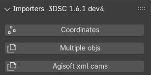

   Importers panel

.. admonition:: Remember

   To import georeferenced data in Blender it is important to set the *SHIFT* data, see the :ref:`Shifting` section.

This panel (:numref:`Fig. %s <ImportersFIG>`) allows importing three data categories in Blender: points, objects, and cameras.

In the current UI, the main buttons are displayed in a flat layout:

- *Points as Empty Objects*
- *Multiple objs*
- *Agisoft XML CAMS* (visible only when *Enable Experimental Features* is active)

Each command also includes a *?* button that opens a contextual help popup with an extended description and a link to online documentation.

.. _ImportersFIG_02:

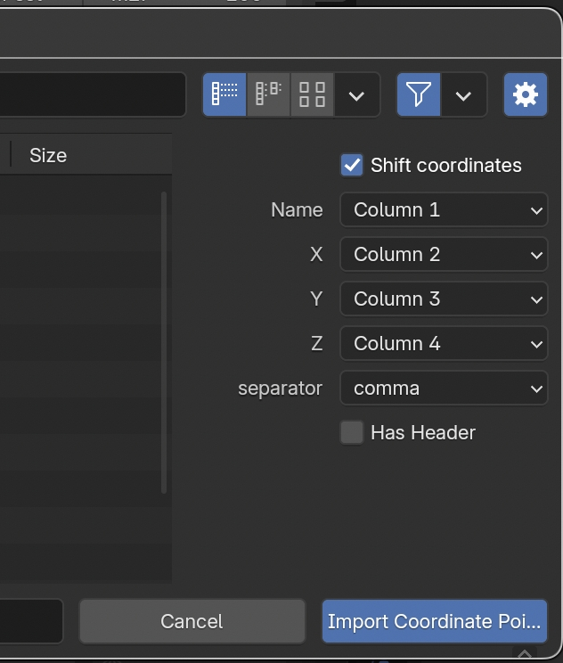

   Option of the Importers panel

By clicking the *Points as Empty Objects* button, users can import a 2D/3D point file (*.csv* or *.txt*) as Empty objects in relative or absolute coordinates.
In the import window, users must: first, locate the appropriate file; second, after pressing the *Toggle Region* button (gear icon on the right side), associate the first 4 columns to name/X/Y/Z and define the separator (comma, space, semicolon, :numref:`Fig. %s <ImportersFIG_02>`).

The options *Shift coordinates* and *Has header* allow to: apply SHIFT values to georeferenced data (when SHIFT has been configured in 3DSC/BlenderGIS) and ignore the first line if the source file has a header.

For a full end-to-end walk-through of the point importer (including
the typical total station / GPS mixed-survey workflow and a
step-by-step recipe for **georeferencing local total station points
onto GPS control points**), see the dedicated recipe
:ref:`import-point-data`.

.. _ImportersFIG_03:

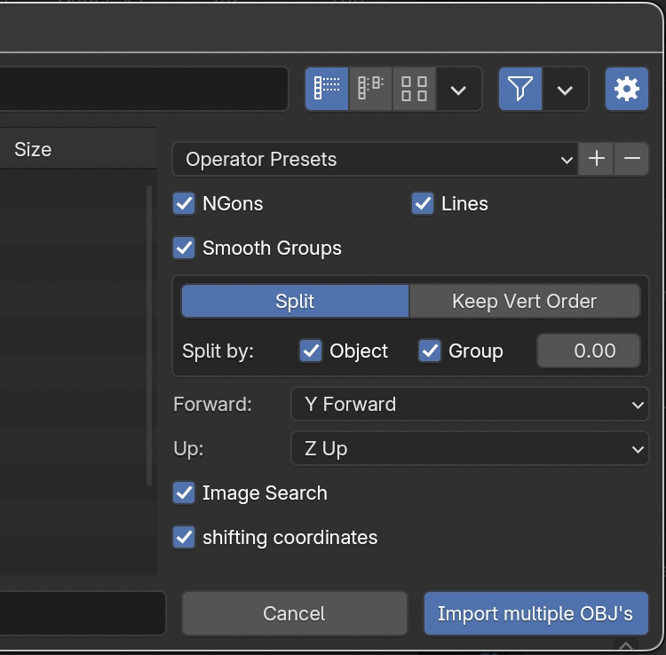

   Option of the Importers panel related to objects

By clicking on the *Multiple objs* button, 3DSC imports several OBJ objects with a single command.
In the import window, users must:

- locate the appropriate file;
- select the correct options on the right side (default options generally work for standard OBJ files). If files are not *Z Up* and *Y Forward*, choose the correct orientation from the drop-down menus (:numref:`Fig. %s <ImportersFIG_03>`).

For a full end-to-end walk-through of the batch import (including the
``Shift coordinates`` option, georeferenced datasets and common
troubleshooting), see the dedicated recipe :ref:`import-batch-obj`.

The *Agisoft XML CAMS* command is currently experimental and is displayed only when experimental features are enabled.

.. admonition:: Remember

   By default, when objects are imported into Blender using the *Importer* tool of 3DSC, geometries are displayed as *Bounds*. 
   To change this display mode, select the *Object* tab, in the Blender's *Properties* panel, then, in the *Viewport Display* panel, select *Display as* -> *Textured* to visualize the objects with their materials.

.. admonition:: Remember

   It is recommended to import objects without textures if they need to be textured later outside Blender.

.. _Exporters:

Exporters
---------

.. _ExportersFIG:

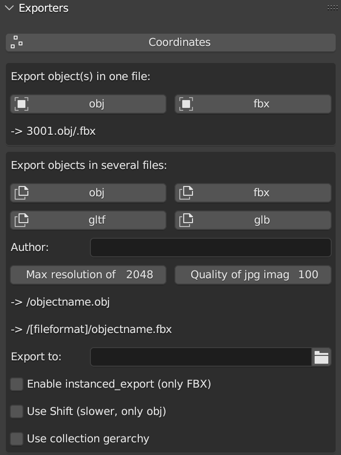

   Exporters panel

This panel (:numref:`Fig. %s <ExportersFIG>`) is divided in three sub-sections: *Coordinates*, *Export object(s) in one file* and *Export objects in several files*.

The *Coordinates* button allows to export every type of coordinates (*.txt* file) associated to an object (such as: points, meshes, cameras etc..) imported in the 3D space of Blender. 
After pressing the button, the export window will appear. 

.. _ExportersFIG_02:

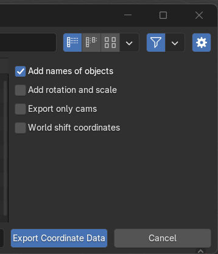

   Exporter window options

To customize the export of these data the user can flag specific options (Add names of objects; Add coordinates of rotation; Export only cams; World shift coordinates) placed on the right side of the export window (:numref:`Fig. %s <ExportersFIG_02>`).  

The other two Exporters execute the same (export) action, with two different results. 
The *Export object(s) in one file* section allows to export, one or multiple objects, in a single file. 
By clicking the *obj* or *fbx* button, the user can choose between two different export file formats (*.obj* or *.fbx*). 
The name of the exported object appears directly below the *obj* and *fbx* buttons. 
By default, the name corresponds to the selected object.

Before starting the export process, the user has to define the correct path of the folder where file(s) will be saved. 

.. admonition:: Remember

   Before closing the path window, it is recommended to uncheck the *relative path* option in the export window settings. Alternatively, within the export panel of 3DSC, it is possible to directly paste the entire path into the empty field and then confirm by pressing the *Enter* button.   

The second option (*Export objects in several files*) allows to export selected objects in several files (*obj*, *fbx*, *gltf*, and *glb*). 
Before exporting the objects, the user can also define properties such as: author, texture resolution, and texture quality. 
Also in this case, a preview of the name associated with the exported objects appears directly below the *Max resolution* and *Quality* buttons. 
By default, the name of each exported objects corresponds to *objectname.fileFormat*.

By activating the *Use shift* options, 3DSC will export only *obj* files with the corresponding shift. 
This option will permit to import these geometries within software that can manage georeferenced data. 
For example, this option will be useful with tiles that need to be textured within a photogrammetric software, as explained in the next sections. 

The Exporter tool of 3DSC allows also to export instanced objects. 
To export this type of objects it is necessary to:

- place in x=0, y=0, z=0 the instanced object with location, scale, and rotation applied (*ctrl+a* command within the viewport of Blender); 
- select all the objects to be exported and then select the object in 0,0,0; 
- click the *Coordinates* button in the *Exporters* panel of 3DSC;
- locate the folder where the *.txt* file has to be saved and set the name of the file
- flag the right options (:numref:`Fig. %s <ExportersFIG_02>`)
- press the *Export Coordinate Data* button.
 
This procedure will create a *.txt* file with the locations of to the instanced object. 
This procedure will work also for *obj*, *fbx*, *gltf* and *glb*. 

At the bottom of the Exporter panel, the option *Enable instanced_export (only FBX)*, if selected, activates an automatic procedure available only for *.fbx* files.
This procedure requires, first, the selection of a group of objects and, then, the add-on will generate a single file *[name]-inst.txt* using the name of the active object.

In the same part of the panel the user can also select two others options: *Use Shift (slower, only obj)* and *use collection gerarchy*.

The option *Use Shift (slower, only obj)* permits to export *obj* file(s) with shift values. 
This process may be slower with big *obj* file(s). 

The option *use collection gerarchy* consents to apply collection gerarchy for creating a tree of subfolders useful for Game Engines.

.. _CesiumTiles:

Cesium Tiles
------------

The *Cesium Tiles* panel exports selected mesh data to Cesium 3D Tiles with two backends:

- *Native Split* (recommended): performs quadtree/octree splitting directly in Blender and writes 3D Tiles 1.1 hierarchy.
- *VTK Writer*: uses ``vtkCesium3DTilesWriter`` when available in the Blender Python environment.

**Dependency and environment checks**

The panel includes a *VTK Dependency Check* section that verifies:

- VTK installation and supported version range;
- availability of Cesium writer symbols;
- optional ``proj.db`` support for EPSG CRS transforms.

If dependencies are missing, install buttons are exposed directly in the panel (same approach used by other dependency-aware tools in 3DSC).

**Source modes**

- *Export active mesh*: exports from current Blender mesh object(s).
- *Use existing OBJ file*: converts an existing ``.obj`` on disk.

When *Export selected meshes* is enabled, each selected mesh is processed in sequence and exported to its own output subfolder.

**Temporary and output folders**

For intermediate exports, the panel supports two temp modes:

- *Auto (near .blend)*: creates/uses ``3dsc2tileTEMP`` next to the saved Blender file;
- *Custom folder*: user-defined path.

Output is written to the configured *Tiles output folder*. With *Create object subfolder* enabled (recommended), each mesh writes to:

``<output>/<object_name>/``

A dedicated trash button can clear temp/output folder contents without deleting the folders themselves.

**Coordinates and CRS modes**

Three coordinate modes are available:

- *Use SHIFT values*: uses EPSG and XYZ from the SHIFT panel (with optional CRS override);
- *Use local coordinates*: local workflow with geocentric fallback CRS;
- *Use custom coordinates*: user-defined XYZ offset and optional CRS.

If CRS is EPSG-based, PROJ data (``proj.db``) must be available.

**Conversion controls**

Main controls include:

- intermediate format (GLB, glTF + textures, OBJ + MTL);
- tree algorithm (Quadtree/Octree);
- features per tile;
- native min/max tree depth;
- quick presets (*Aggressive hierarchy*, *Balanced*, *Few tiles*).

In some VTK builds, tree-type API is not exposed; in that case Quadtree/Octree UI has no effect for *VTK Writer* backend.

**Advanced hierarchy layout**

With *Native Split* backend, two hierarchy layouts are available:

- *Single JSON*;
- *External sub-tilesets* (nested references).

In external mode, output follows a structure with grouped subtree folders and local tile content (for example ``Data/c00/tileset.json`` plus multiple ``f*.glb`` files in the same subtree folder).

**Tileset Stitcher**

The *Tileset Stitcher* section can build/update a parent tileset JSON in the output root:

- *Auto-update parent tileset after export*;
- manual *Rebuild Parent Tileset* button.

This supports iterative workflows where new mesh tilesets are appended over time and referenced from one parent entry point.

**Live progress and statistics**

During export, the panel displays a lightweight live monitor (without complex progress bar):

- current task and mesh index;
- elapsed time;
- recent operation log;
- last mesh statistics.

Per-mesh summary includes values such as initial faces/vertices, estimated area in m2, detected textures, produced tiles, subtree count, and processing time.

.. admonition:: Remember

   UV atlas is not strictly required to create tilesets. However, valid UVs are required for correct textured rendering in output tiles.

.. _Quick_Utils:

Quick Utils
-----------

.. _Quick_UtilsFIG:

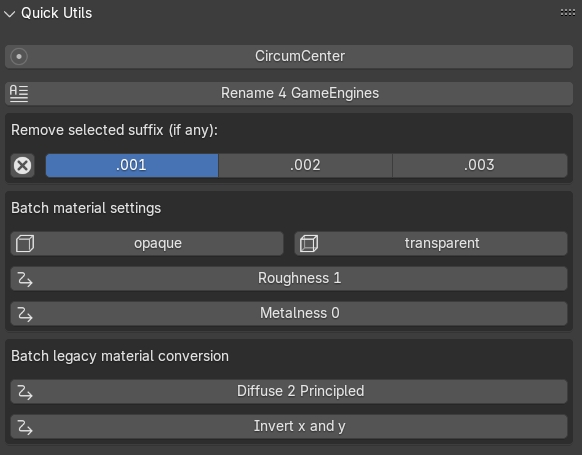

   Quick Utils panel

This panel (:numref:`Fig. %s <Quick_UtilsFIG>`) contains miscellaneous utility commands for cleaning and preparing objects before downstream operations.

The Quick Utils panel includes:

- *Vertex Merge by Distance*
- *Rename 4 GameEngines*
- *Invert x and y*
- *Remove selected suffix (if any)*
- *Batch material settings*
- *Batch legacy material conversion*

**Vertex Merge by Distance**

Merges near-duplicate vertices on selected meshes.

**Rename 4 GameEngines**

Renames selected objects using a game-engine oriented naming convention.

**Invert x and y**

Swaps X and Y coordinates of selected objects while preserving Z.
This is useful when total-station point datasets are imported with swapped XY axes.

**Remove selected suffix (if any)**

Removes selected suffixes (*.001*, *.002*, *.003*) from object names in batch.

**Batch material settings**

Changes material parameters on selected objects:

- *opaque*: sets material Blend Mode to *Opaque*;
- *transparent*: sets material Blend Mode to *Alpha Blend*;
- *Roughness 1*: sets Principled BSDF roughness to 1;
- *Metalness 0*: sets Principled BSDF metallic value to 0.

**Batch legacy material conversion**

The *Diffuse 2 Principled* command converts legacy diffuse-style materials into Principled BSDF-based materials.

**Additional root-level utility panels**

The following utility panels are available as separate root-level panels in the 3DSC sidebar:

- *Rotation Constrained*
- *Circle from 3 Points*
- *Alignment Orientation*
- *Texture Smart Mapping*

.. _Segmentation:

Segmentation
------------

.. _SegmentationFIG:

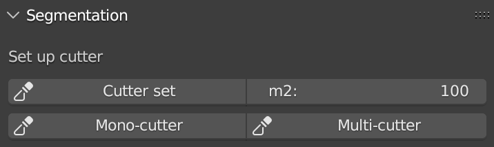

   Segmentation panel

The Segmentation panel is centered on cutter-based splitting workflows.

.. _segmentation-cutter-set:

**Cutter set + m2**

- *Cutter set* generates a cutter grid based on the active mesh extent and the selected square meters value (*m2*).
- Before creation, if the active object scale is not *1,1,1*, the tool shows a warning popup and can apply scale automatically.
- Generated cutters are organized in the root collection named *_cutter*.
- Cutters are moved to *_cutter* (not duplicated in the source object collection).

**Cutter availability**

- The panel shows the number of cutters currently available in scene.
- A *Delete all cutters* command removes all cutter meshes from *_cutter*.

.. _segmentation-cut-modes:

**Multi-cutter / Mono-cutter**

- *Multi-cutter* (main workflow): the active target mesh is cut by selected cutter objects; if no cutters are selected, all cutters available in *_cutter* are used automatically.
- *Mono-cutter* (advanced workflow): one active cutter mesh projects cuts on selected non-cutter meshes.

Both modes are enabled only when cutters are available.

**Pre-cut topology check**

Before segmentation, target meshes can run a basic topology cleanup (merge/remove doubled vertices) to reduce knife projection issues.
The panel includes a toggle (*Topology pre-clean before cut*) to enable/disable this step depending on model quality and performance needs.

.. 
This panel (:numref:`Fig. %s <SegmentationFIG>`) allows to use a set of tools to segment a 3D object in tiles. 
This procedure could help user to manage both the texture phase (outside of Blender) and the LODs creation of a high-resolution 3D object (such as, photogrammetric dataset or 3D scans).

.. admonition:: Remember

 Before using this tool, it’s necessary to control the scale of each 3D object that must be segmented.
 To control the scale of a 3D object it is recommend to check the scale value in the *Scale* panel, located within the *Item* tab, on the *Sidebar* of Blender. 
 If the 3D object is the result of a 3D survey, it must match its real dimensions. 
 If the scale values of the 3D object are not equal to 1 (in XYZ), the user must modify the scale and apply the transformation (*ctrl+a* -> *Scale*, or *ctrl+a* -> *All transforms*). 
   

To set a regular grid, useful to segment a 3D object with the *Segmentation* tool, it is necessary to define the area of each tile of the grid compared with the dimension of the 3D object (to be segmented). 
Before generating the *Cutter grid*, user can adjust the extent of each tile of the grid by changing the *Area value (m2)* on the right side of the *Set up cutter* panel.

After pressing the *Cutter set* button, if the dimension of the grid does not correctly fit the dimension of the 3D object, user can: select all the tiles of the grid (on the outliner of Blender, every tile of the grid is automatically named as *cutter* followed by a consecutive number *.001*, such as *cutter.001*) and scale them using the scale command of Blender (in this case, the reference point for the scaling action is automatically placed, by the add-on, on the lower left corner of the grid). 
It is strongly recommended to use *Top Orthographic* view of Blender to set the position of the *Cutter grid*.

After clicking on the *Cutter set* button, a grid will appear in the viewport of Blender. 
The grid will fully cover the entire XY-plane extension of the mesh that needs to be cut. 
By default, the *Cutter grid* consists of square faces with 10-meter edges.  

.. _TileTexturing:

Tile texturing
--------------

After tiles has been created, if 3D data are related to a photogrammetric dataset processed with Metashape, the `Extended Matrix Framework <https://www.extendedmatrix.org/discover/emf>`_ consents to use a semi-automatic procedure that allows to import each tile within Metashape to create a new texture. 

The following steps need to be completed to use the script.

.. _3DSC_for_MetaFIG:

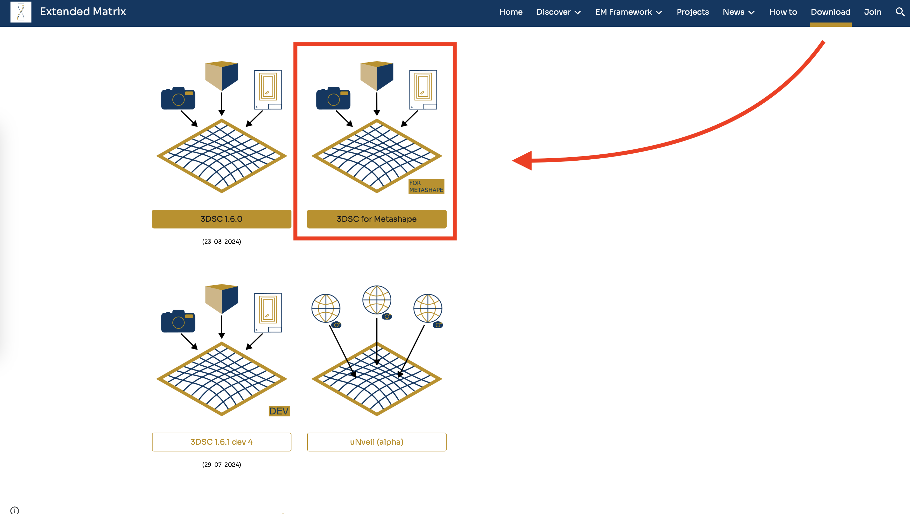

   How to reach the download button of the script *3DSC for Metashpe* within the Extended Matrix webpage

Download the script (3DSC for Metashape) from GitHub. 
The link to the webpage of the script can be reached from the Download section of Extended Matrix website (https://www.extendedmatrix.org/download). 
In GitHub , to download the script the user must click on the *Code* green-button and press *Download ZIP*.

.. _3DSC_for_Meta_GITHUBFIG:

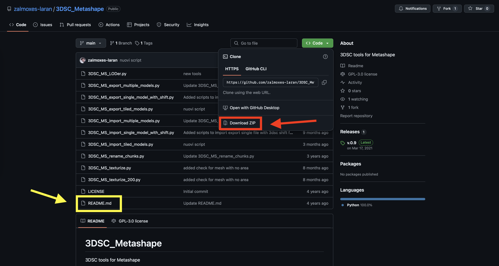

   GitHub webpage where the user can download the *3DSC for Metashape* script. 
   The red rectangle highlights the button that allows to download the zip folder of the script. 
   The yellow rectangle highlights the file which contains instructions.

Within the unzip-folder (the user must unzip the folder to use the script) the *readme.md* file contains the useful instructions to correctly use the script in Metashape.

.. admonition:: Remember

 When textures are created outside Blender and may later be re-imported and modified within Blender, it is recommended to save them as *.png* instead of *.jpg* to avoid texture data loss.
 While this approach may increase file size (in terms of data storage), it will help preserve the quality and prevent information loss.

.. seealso::

   **Complete Workflow**: For a complete end-to-end workflow from photogrammetry 
   to stratigraphic annotation using LOD Generator, Segmentation, and other 3DSC tools, 
   see :doc:`digital_replica_preparation`.

.. _LODgenerator:

LOD generator
-------------

.. _LODgeneratorFIG:

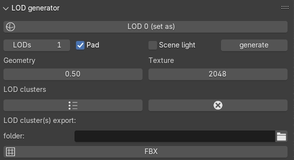

   LOD generator panel

This panel (:numref:`Fig. %s <LODgeneratorFIG>`) consents to generate Levels of Details (LODs) of a selected mesh. 
This type of tool helps manage large and detailed datasets, such as a mesh obtained through photogrammetry, or mesh from laser scanner. 

To use this tool the user needs to first indicate the *LOD0* object, that is the mesh with the highest level of detail within the *.blend* file. 
To do this, first select the object and, then press the *LOD 0 (set as)* button to designate it as the *LOD 0* object.

Before generating LODs some steps need to be follow:

- set the number of LODs by entering the correct value under the *LOD 0 (set as)* button; 
- select the *Pad* option to activate the *Paddin ratio* for LOD creation; 
- set the *Decimation ratio*; 
- set the *Resolution* of the baked texture; 
- indicate the path of the folder where LOD(s) will be saved.

.. admonition:: Remember

 Before closing the path window, it is recommended to uncheck the *relative path* option in the export window settings. 
 Alternatively, within the export panel of 3DSC, it is possible to directly paste the entire path into the empty field and then confirm by pressing the *Enter* button.

After all these options have been set, pressing the *generate* button will create LODs in the desired folder. 

If necessary, *LOD generator* tool permits to create a group of LODs, by clicking on the *LOD clusters* button, and remove it, by pressing the *X* button. 

The *FBX* button allows to export LODs’ cluster in FBX format in the folder previously indicated. 

.. _LODmanager:

LOD Manager
-----------

.. _LODmanagerFIG:

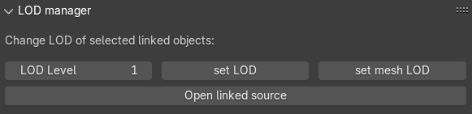

   LOD Manager panel

This panel (:numref:`Fig. %s <LODmanagerFIG>`) consents to change the LOD for each tile related to a high-res 3D dataset (such as, a photogrammetric survey of an archaeological context), previously segmented using the *Segmentation* tool of 3DSC, displayed in the viewport of Blender.  

By using *LOD manager* it is possible to visualize in Blender different tiles, related to the same 3D dataset, with different LODs.

.. admonition:: Remember

 *LOD manager* can be employed only if LODs have been previously generated.

The tool allows to visualize two different linked data: **objects** or **meshes**.  
To import linked data in Blender these simple steps must be followed: 

- Press *File* -> *Link...*; 

- Locate the *.blend* (all the options displayed on the right side of the window can be selected. If any issues occur, deselect the *Relative Path* option); 

- If the imported linked data do not require modifications in scale and position, select the *Object* folder and then select the desired **objects**; 

- If the imported linked data require modifications in scale and positions, select the *Mesh* folder and then select the desired **meshes**. 

- Linked data (*objects* or *meshes*) can be grouped in different collections of Blender. 
By following the EM methods, these data should be stored within the same collection, for example the *RB* collection (that is, *Reality Based* collection), or in multiple collections.  

.. admonition:: Remember

 It is not recommended to store linked data in sub-collections (such as, *sub-RB*). 
 In that case, after setting *LOD level* and pressing *set LOD* or *set mesh LOD*, 3DSC will automatically display an error message and create a linked object, or mesh, within the main collection *RB*.

To visualize LODs related to **linked object**:  

- select a linked object; 
- Set the LOD value to be visualized; 
- press the “set LOD” button. 

To visualize LODs related to **linked meshes**: 

- select a linked mesh; 
- Set the LOD value to be visualized; 
- press the “set mesh LOD” button. 

This type of tool allows to manage the visualization of large datasets which have already been segmented (using the *Segmentation* tool). 
Using this tool users can view different tiles of the same 3D mesh with different LODs

.. admonition:: Remember

 This tool can be employed only if LODs have been previously generated

To visualize a specific LOD: 
first, select an object that has been previously processed with the *LOD generator tool*; 
second, enter the desired LOD to be visualized; 
third, press the *set LOD* button.

.. _Model_Inspector:

Model Inspector
---------------

.. _Model_Inspector00FIG:

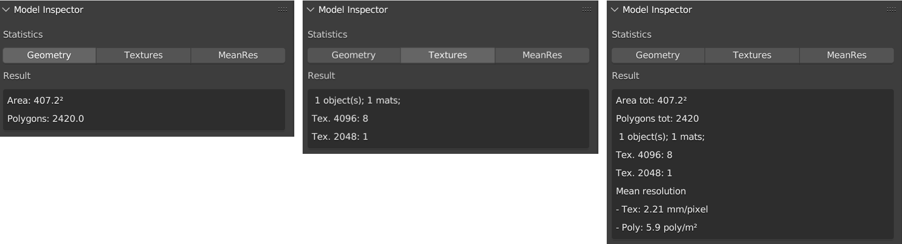

   Model Inspector panel (*Geometry*, *Textures*, *MeanRes* plus Strict/Export controls)

This panel consists of three main parts (:numref:`Fig. %s <Model_Inspector00FIG>`): *Geometry*, *Texture* and *MeanRes*.

Current UI layout:

- first row: analysis buttons (*Geometry*, *Textures*, *MeanRes*);
- second row: behavior toggles (*Strict mode*, *Prompt export after MeanRes*);
- third row: dedicated *Export Stats* button.

By clicking on the *Geometry* button the add-on returns some statistics on the geometry of the selected 3D object (*area* and *number of polygons*).

By clicking on the *Textures* button the add-on returns some statistics on the texture of the selected 3D object (*number of materials*, *texture resolution*, *number of textures per resolution*).

By clicking on the *MeanRes* button the add-on returns a summary of all statistical values (*Geometry*, *Texture* and *MeanRes*) concerning the selected object(s): *area*, *polygon count*, *material/texture distribution*, *mean texture resolution* (mm/pixel) and *mean polygon density* (:math:`poly/m^2`).

**Robust statistics mode**

- The inspector now handles meshes without materials/textures without crashing.
- In default mode, unsupported data are skipped and reported in the result (for example: missing materials or missing image textures).

**Strict mode**

- If *Strict mode* is enabled, *Textures* and *MeanRes* fail when required texture/material data are missing.
- Use this mode for QA workflows where incomplete data must be treated as blocking.

**Export behavior**

- *MeanRes* no longer forces file export by default.
- Enable *Prompt export after MeanRes* to open the export dialog automatically after the analysis.
- Use the dedicated *Export Stats* button to save the current statistics table to CSV on demand.

|

.. _ColorCorrection:
.. _color-correction:

Color Correction
----------------

This panel allows the user to apply a material color correction to one or multiple selected objects (:numref:`Fig. %s <ColorCorrectionFIG>`). 

.. _ColorCorrectionFIG:

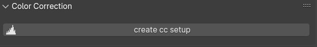

   *Color Correction* panel

To start the procedure, select one or multiple objects and press *create cc setup*.
The setup is non-destructive and uses a shared CC node group across selected materials.
Node discovery is robust: materials are resolved by shader type and graph connections (not by fixed node names).

.. _ColorCorrection02FIG:

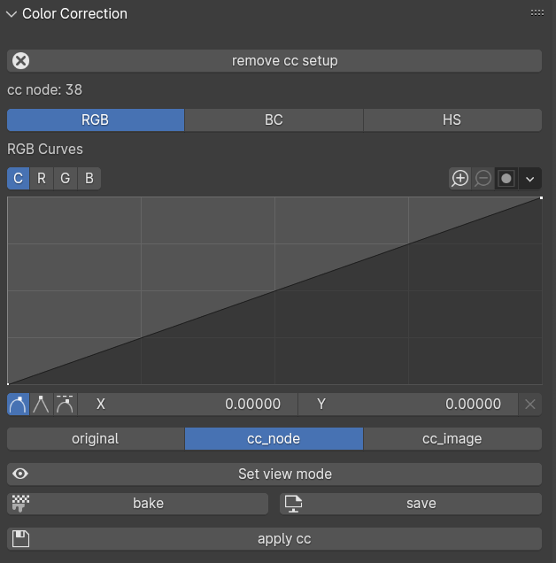

   *Color Correction* panel, activation of the three color profile modifiers (*RGB*, *BC*, and *HS*).

When the procedure is activated, the panel changes its layout (:numref:`Fig. %s <ColorCorrection02FIG>`): 

- the *remove cc setup* button appears on top of the panel; 
- the name of the edited objects (*cc node: test*) is displayed below the *remove cc setup* button itself; 
- a new set of buttons complete the rest of the panel. 

Three buttons (*RGB*, *BC*, *HS*) allow to edit the color profile of the texture material. 

When *RGB* is pressed the RGB curve appears and it allows to easily change RGB values by moving the line within the graph (:numref:`Fig. %s <ColorCorrection02FIG>`). 
The interaction with the curve is similar to that of a standard image editor. 

.. _ColorCorrection03FIG:

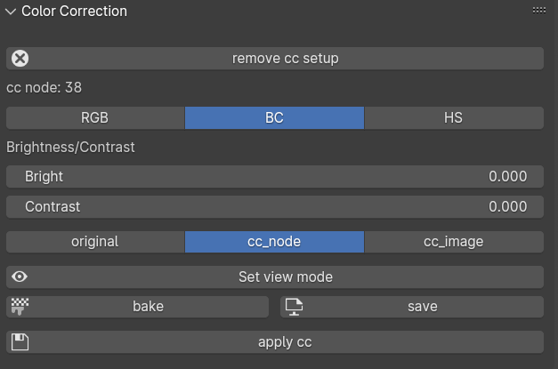

   *Brightness* and *Constrast* modifiers

When *BC* is pressed, the *Brightness* and *Constrast* sliders appear (:numref:`Fig. %s <ColorCorrection03FIG>`). 

.. _ColorCorrection04FIG:

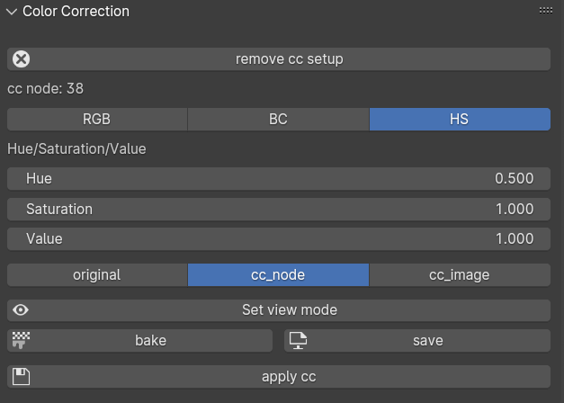

   *Hue* and *Saturation* modifiers

Similarly, when *HS* is pressed, the *Hue*, *Saturation*, and *Value* sliders are displayed at the center of the panel. 

Below the *RGB*, *BC*, and *HS* buttons, three additional buttons allow to change the visualization of the material applied to the geometry: *original* displays the original material of the selected object(s); *cc_node* shows the material with the temporary color correction applied; and *cc_image* represents the final result, after baking. 

To display these three temporary results, select one of the options (*original*, *cc_node*, or *cc_image*) and then press the *Set view mode* button. 

.. _color-correction-bake-apply:

The *bake* button allows to bake all the changes made to the original texture, using Blender’s internal bake function. 
These changes can be automatically saved by pressing the *save* button. 

The *apply cc* button consents to use the new-modified material. 
In this case *EM tools* promotes the baked *cc_image* and keeps a backup reference to the original texture for rollback.

By pressing the *remove cc setup* button, located at the top of the *Color Correction* panel, the user can easily restore the original material. 

.. _color-correction-troubleshooting:

**Troubleshooting**

- Renamed image/BSDF nodes are supported.
- Materials without a valid Principled/Diffuse color pipeline are skipped and reported.

.. _Photogrammetry_paint:

Photogrammetry paint
--------------------

.. _Photogrammetry_paintFIG:

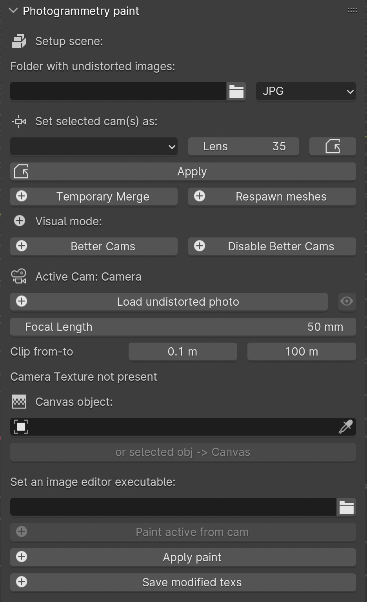

   Photogrammetry Paint panel

The *Photogrammetry Paint* panel in Blender is tailored for enhancing photogrammetric workflows. 
It provides a suite of tools for image and texture editing, enabling the user to work efficiently within the 3D environment. This panel facilitates various tasks such as:

- manage undistorted images;
- merge and separate meshes for texture painting;
- adjust camera settings for image projection;
- integrate images with external image editors for in-depth texture work.

The *Setup Scene* section initializes the scene for photogrammetric texture editing.

Within the *Folder with Undistorted Images* section the user can assign a directory to indicate where undistorted images are stored before using them during the texture painting.

The *Set Selected Cam(s) As* section includes several buttons: 

- *Lens*: Select the type of lens used to capture your images.
- *Focal Length*: Input the focal length of the camera lens.
- *Apply*: Save your configured camera settings.
- *Temporary Merge*: Combine selected meshes for collective texturing.
- *Respawn Meshes*: Separate previously merged meshes back to their original state.

The *Temporary Merge* function allows users to temporarily join two mesh objects in the scene. 
This feature is particularly useful for tasks that require meshes to be combined, such as texture painting to correct imperfections. For instance, users can utilize a clone stamp to transfer texture from one part of a mesh to another, effectively treating the meshes as a single unit. 
This can also be useful for creating a single UV unwrap atlas for multiple objects. 
After the necessary operations are completed, the "Respawn" button can be used to separate the meshes and return them to their original state.

The *Visual Mode* section inlcudes two functions: 
- *Better Cams*: Enhance camera visualization for easier editing.
- *Disable Better Cams*: Revert to the standard camera view.

The *Active Cam* section displays the camera that is currently being used for editing.
This part of the panel presents three important functions:

- *Load Undistorted Photo*: Load the undistorted image for the active camera, ready for texture painting.

- *Focal Length/Clip from-to*: Fine-tune the active camera's focal length and clipping range for precise texture projection.

- *Camera Texture Not Present*: Notification when a camera texture is missing.

*Canvas Object* section allows to simply select the object which will receive the projected textures.

The *Set an Image Editor Executable* section permits to specify the path to an external image editor for advanced texture editing.

Within the *Post-Processing in External Image Editors* section it is possible to apply and save the final result.

After pressing the *Paint Active from Cam* button, the user engages in a post-processing phase, typically in an external image editor such as GIMP or Photoshop. 
Here is what generally occurs during this phase witihn GIMP/Photoshop:

- *Open Image Editor*: GIMP or Photoshop launches with two instances; one displaying the active camera's view and the other showing the undistorted image.

- *Copy/Paste Textures*: 
  * Use *CTRL+A* and *CTRL+C* to select and copy the entire undistorted image.
  * Paste it onto the canvas that represents the 3D model.

- *Clone Brush Tool*: Utilize the clone brush to remove unnecessary parts of the photograph and make chromatic adjustments. This ensures that the newly applied texture blends seamlessly with the existing textures.

- *Finalizing Texture*: Once the texture editing is complete:
  * Disable the background layer in the image editor to isolate the new texture.
  * Save the new texture by overwriting the existing file or as a new file to be used as a patch.

- *Apply New Texture in Blender*: Back in Blender, the *Apply Paint* function transfers the edited texture onto the 3D model.

- *Save and Update Model*: Hit *Save Modified Textures* to save your changes, solidifying the improved texture on the model.

.. admonition:: Remember

 It's important to periodically save your work in the external editor and keep track of version changes to ensure a smooth workflow.

Leverage the Photogrammetry Paint panel to ensure your textures align perfectly with the undistorted images, creating high-quality, realistic 3D models.

|

.. _Texture_mixer:

Texture mixer
-------------

.. _Texture_mixerFIG:

|
