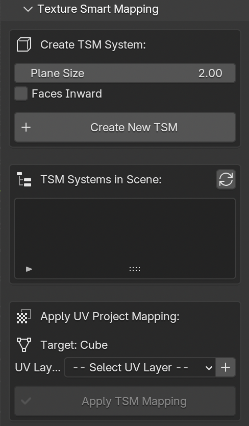
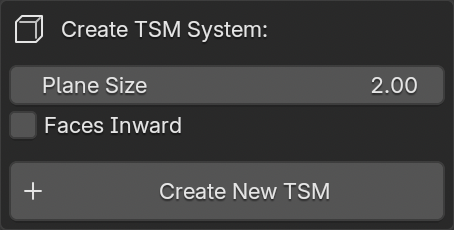
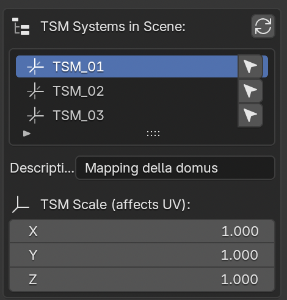
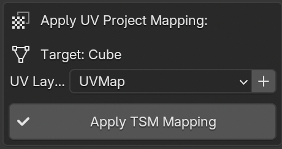

.. _Texture_Smart_Mapping:

Texture Smart Mapping (TSM)
============================

.. _TSM_FIG:

   Texture Smart Mapping panel

The **Texture Smart Mapping** (TSM) panel (:numref:`Fig. %s <TSM_FIG>`) is a sub-panel within the *Quick Utils* section. It provides an efficient workflow for applying texture projections to 3D meshes using a standardized cubic projection system with 6 oriented planes.

This tool is particularly useful for:

- Rapid texture mapping of architectural elements
- Standardized UV projection workflows
- Multi-object texture application with consistent projection settings
- Managing multiple texture mapping configurations in the same scene

.. contents::
   :local:
   :depth: 2

.. _TSM_Create:

Creating a TSM System
---------------------

.. _TSM_CreateFIG:

   TSM creation options

To create a new TSM system (:numref:`Fig. %s <TSM_CreateFIG>`):

1. Select an object in the 3D viewport (can be an empty object or any mesh)
2. Set the desired parameters:
   
   - **Plane Size**: Defines the size of each projection plane in meters (default: 2.0m)
   - **Faces Inward**: Checkbox to orient projection faces toward the center (inward) or outward

3. Click the **Create New TSM** button

The operator will automatically:

- Create a new empty object named ``TSM_XX`` (with automatic numerical suffix)
- Generate 6 plane objects (top, bottom, front, rear, left, right) parented to the TSM empty
- Position and orient the planes correctly to form a cubic projection setup
- Maintain the location, rotation, and scale of the originally selected object
- Add the new TSM to the system list

.. admonition:: Technical Details

   - TSM systems are identified by a custom property ``tsm_system = True``
   - Each plane is exactly positioned at ``plane_size/2`` distance from the TSM center
   - All planes maintain a scale of (1.0, 1.0, 1.0) to avoid UV distortion
   - The system correctly handles any rotation of the source object

.. _TSM_List:

TSM Systems List
----------------

.. _TSM_ListFIG:

   TSM systems management

The TSM systems list (:numref:`Fig. %s <TSM_ListFIG>`) displays all available TSM systems in the current scene.

**List Features:**

- **Refresh Button**: Manually updates the list to detect new or removed TSM systems
- **Auto-refresh**: The list automatically updates after creating a new TSM
- **Select Icon**: Selects the corresponding TSM empty object in the 3D viewport

**Per-TSM Information:**

- **Description Field**: Editable text field to add descriptive information (e.g., "Mapping for Severan period buildings")
  
  - Automatically saved as custom property ``tsm_description`` on the TSM empty object
  - Useful for organizing multiple TSM systems with different purposes

- **TSM Scale**: Displays and allows editing of the X, Y, Z scale values
  
  - Directly affects the UV projection scale
  - Modifying scale values updates the projection in real-time
  - Useful for fine-tuning the texture mapping without recreating the system

.. admonition:: Remember

   Editing the TSM scale values will automatically influence the UV projection scale on all meshes using that TSM system.

.. _TSM_Apply:

Applying UV Project Mapping
----------------------------

.. _TSM_ApplyFIG:

   UV Project mapping application

The **Apply UV Project Mapping** section (:numref:`Fig. %s <TSM_ApplyFIG>`) allows users to apply the selected TSM projection system to mesh objects.

**Workflow:**

1. **Select a TSM** from the list above
2. **Select a mesh object** in the 3D viewport (the target object is displayed in the panel)
3. **Choose or create a UV layer**:
   
   - Use the dropdown menu to select an existing UV layer
   - Click the **+** button to create a new UV map with a custom name (default: "TSM_UVMap")

4. Click **Apply TSM Mapping**

**UV Layer Management:**

The panel automatically detects all UV layers present in the selected mesh object. If no UV layers exist, the panel displays a warning and provides the option to create one.

The **Add New UV Map** operator:

- Opens a dialog to specify the UV map name
- Creates the new UV layer
- Automatically selects it in the dropdown menu
- Sets it as the active UV layer

.. admonition:: Important

   If the mesh object already has a UV Project modifier, the operator will display a warning and skip the operation to prevent conflicts.

.. _TSM_Technical:

Technical Implementation
------------------------

**Modifier Configuration:**

When applying a TSM system to a mesh, the operator:

1. Creates a new **UV Project** modifier named ``TSM_UVProject_[TSM_name]``
2. Sets the ``projector_count`` property to 6
3. Assigns the 6 planes (top, bottom, front, rear, left, right) as projectors
4. Links the modifier to the selected UV layer
5. Maintains default modifier parameters (Aspect X, Aspect Y, Scale X, Scale Y)

**Projector Assignment:**

The 6 planes are assigned to the UV Project modifier in the following order:

1. Top (plane facing +Z local axis)
2. Bottom (plane facing -Z local axis)
3. Front (plane facing +Y local axis)
4. Rear (plane facing -Y local axis)
5. Right (plane facing +X local axis)
6. Left (plane facing -X local axis)

This arrangement ensures complete coverage of the mesh from all cardinal directions.

.. _TSM_UseCases:

Use Cases
---------

**Architectural Documentation:**

The TSM system is particularly effective for documenting architectural elements where orthogonal projections are required:

- Wall faces and facades
- Floor and ceiling surfaces
- Column capitals and bases
- Architectural details requiring precise texture placement

**Archaeological Objects:**

For archaeological artifacts with approximately cubic or box-like proportions:

- Stone blocks and ashlars
- Sarcophagi and altars
- Architectural fragments
- Sculptural reliefs

**Multi-Phase Workflows:**

TSM systems can be organized by:

- **Chronological phases**: Create separate TSM systems for different historical periods (e.g., "Republican period mapping", "Imperial period mapping")
- **Material types**: Different projections for stone, brick, stucco surfaces
- **Documentation campaigns**: Organize by survey date or acquisition method

.. admonition:: Best Practices

   - Use descriptive names in the TSM description field for easy identification
   - Adjust TSM scale values to match the actual dimensions of the surveyed elements
   - Create multiple TSM systems with different scales for objects at different detail levels
   - Position TSM empties at the center of the target objects for optimal projection

.. _TSM_Workflow:

Complete Workflow Example
--------------------------

**Scenario:** Texturing a photogrammetric model of a Roman wall section

1. **Preparation:**
   
   - Import the photogrammetric mesh
   - Create an empty object at the center of the wall section
   - Adjust the empty's rotation to align with the wall's main axes

2. **TSM Creation:**
   
   - Select the empty object
   - Set plane size to 4.0 meters (appropriate for a wall section)
   - Keep "Faces Inward" unchecked (projecting outward onto the wall)
   - Click "Create New TSM"
   - Add description: "Severan period east wall"

3. **UV Setup:**
   
   - Select the wall mesh
   - Create a new UV map named "TSM_Projection"
   - Select this UV layer in the dropdown

4. **Apply Mapping:**
   
   - Select the TSM from the list
   - Click "Apply TSM Mapping"
   - The UV Project modifier is added with 6 projectors

5. **Fine-tuning:**
   
   - Adjust the TSM scale (X, Y, Z) to better fit the wall dimensions
   - The UV projection updates automatically
   - Add textures to the material using the projected UVs

6. **Documentation:**
   
   - Export the modified mesh with the TSM_UVProject modifier applied
   - The projection setup can be reused for similar wall sections

.. _TSM_Notes:

Additional Notes
----------------

**Performance Considerations:**

- TSM systems are lightweight (empty object + 6 simple planes)
- Multiple TSM systems can coexist in the same scene without performance impact
- UV Project modifiers are evaluated efficiently in Blender's modifier stack

**Compatibility:**

- TSM systems work with any Blender version supporting UV Project modifiers (2.80+)
- Compatible with other modifiers in the stack
- Can be used in conjunction with other 3DSC tools (LOD generation, texture patching, etc.)

**Limitations:**

- Only one UV Project modifier per mesh is supported by the operator (to prevent conflicts)
- Best results are achieved with approximately cubic or box-shaped geometries
- For complex organic shapes, manual UV unwrapping may be more appropriate

.. admonition:: Remember

   TSM systems are non-destructive. The modifier can be disabled or removed at any time, and the original mesh geometry remains unchanged.
